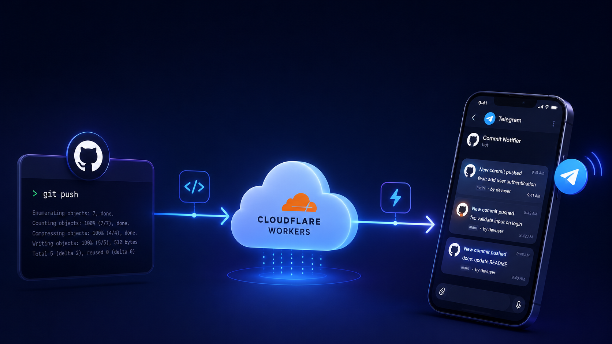

# From Git Push to Telegram: Building a Real-Time Commit Notifier with Cloudflare Workers



Have you ever pushed a commit to a private project and wished you could see it pop up instantly somewhere your whole team is already watching? That's exactly what we're building today - a lightweight webhook that fires every time you push to GitHub and drops a clean notification straight into your Telegram group.

No third-party services, no monthly fees. Just a Cloudflare Worker, a Telegram bot, and about 15 - 20 minutes of your time.

Blog link: https://medium.com/@mohammadmoosapoor4/from-git-push-to-telegram-building-a-real-time-commit-notifier-with-cloudflare-workers-9fd1b6c14a44

---

## Step 1 — Create your Telegram bot

Open Telegram and search for **@BotFather**. Send `/newbot`, follow the prompts, and you'll receive a **bot token** that looks something like this:

```
7481234567:AAFxyz_exampleTokenHere
```

Save it somewhere safe — you'll need it shortly.

---

## Step 2 — Add the bot to your group or channel

Add your newly created bot to the group or channel where you want commit notifications to land. Then promote it to **admin** — without admin privileges, the bot won't be able to send messages.

---

## Step 3 — Get your Chat ID

Send any message inside the group, then open the following URL in your browser (replace `<BOT_TOKEN>` with your actual token):

```
https://api.telegram.org/bot<BOT_TOKEN>/getUpdates
```

You'll see a JSON response. Look for the `chat` object and grab the `id` field — it usually looks like `-1001234567890` for groups. Save that too.

---

## Step 4 — Create a Cloudflare Worker

Head over to the [Cloudflare dashboard](https://dash.cloudflare.com), then navigate to:

**Workers & Pages → Create Application → Create Worker**

Choose the **Hello World** template and hit deploy. You'll land in the editor — that's where the magic happens.

---

## Step 5 — Drop in the code

Replace everything in the editor with the following worker:

```javascript
export default {
  async fetch(request) {
    // ====== CONFIG — fill these in ======
    const BOT_TOKEN = "YOUR_BOT_TOKEN";
    const CHAT_ID = "YOUR_CHAT_ID";
    // const THREAD_ID = <topic_id>; // uncomment this line if you're using a topic/thread

    // Only accept POST requests from GitHub
    if (request.method !== "POST") {
      return new Response("Method Not Allowed", { status: 405 });
    }

    let data;
    try {
      data = await request.json();
    } catch {
      return new Response("Invalid JSON", { status: 400 });
    }
    
    // Route to the correct handler based on the GitHub event type
    const eventType = request.headers.get("x-github-event");

    if (eventType === "push") {
      await handlePush(data, BOT_TOKEN, CHAT_ID, THREAD_ID);
    } else if (eventType === "pull_request") {
      await handlePR(data, BOT_TOKEN, CHAT_ID, THREAD_ID);
    }

    return new Response("OK", { status: 200 });
  }
};

// ====== PUSH HANDLER ======
async function handlePush(data, botToken, chatId, threadId) {
  const repo = data.repository?.full_name || "unknown";
  const branch = data.ref?.split("/").pop() || "unknown";
  const commits = data.commits || [];

  if (commits.length === 0) return;

  let msg;

  if (commits.length === 1) {
    const commit = commits[0];
    msg =
`🚀 *New Push*

📦 Repo: ${escMd(repo)}
🌿 Branch: ${escMd(branch)}
👤 Author: ${escMd(commit.author?.name)}
🕐 Time: ${escMd(formatDate(commit.timestamp))}
📝 Message: ${escMd(truncate(commit.message, 300))}
✅ Status: Success
🔗 [View Commit](${commit.url})`;
  } else {
    const commitLines = commits.map((c, i) =>
      `${i + 1}\\. ${escMd(truncate(c.message, 100))} \\— ${escMd(c.author?.name)}`
    ).join("\n");

    msg =
`🚀 *${escMd(String(commits.length))} Commits Pushed*

📦 Repo: ${escMd(repo)}
🌿 Branch: ${escMd(branch)}
🕐 Time: ${escMd(formatDate(commits[commits.length - 1].timestamp))}
✅ Status: Success

📝 *Commits:*
${commitLines}

🔗 [View Changes](${data.compare})`;
  }

  await sendTelegram(botToken, chatId, threadId, msg);
}

// ====== PULL REQUEST HANDLER ======
async function handlePR(data, botToken, chatId, threadId) {
  const action = data.action;
  if (!["opened", "closed", "merged"].includes(action)) return;

  const pr = data.pull_request;
  const statusEmoji = action === "opened" ? "🟢" : pr.merged ? "🟣" : "🔴";
  const status = pr.merged ? "Merged" : action.charAt(0).toUpperCase() + action.slice(1);

  const msg =
`${statusEmoji} *Pull Request ${escMd(status)}*

📦 Repo: ${escMd(data.repository?.full_name)}
🔀 Branch: \`${escMd(pr.head?.ref)}\` → \`${escMd(pr.base?.ref)}\`
👤 Author: ${escMd(pr.user?.login)}
📝 Title: ${escMd(truncate(pr.title, 200))}
✅ Status: ${escMd(status)}
🔗 [View PR](${pr.html_url})`;

  await sendTelegram(botToken, chatId, threadId, msg);
}

// ====== TELEGRAM SENDER ======
async function sendTelegram(botToken, chatId, threadId, text) {
  const res = await fetch(`https://api.telegram.org/bot${botToken}/sendMessage`, {
    method: "POST",
    headers: { "Content-Type": "application/json" },
    body: JSON.stringify({
      chat_id: chatId,
      message_thread_id: threadId,
      text,
      parse_mode: "MarkdownV2",
      disable_web_page_preview: true,
    }),
  });

  if (!res.ok) {
    const err = await res.json();
    console.error("Telegram error:", JSON.stringify(err));
  }
}

// ====== HELPERS ======
function truncate(text, max) {
  if (!text) return "";
  const firstLine = text.split("\n")[0];
  return firstLine.length > max ? firstLine.slice(0, max) + "…" : firstLine;
}

function formatDate(iso) {
  if (!iso) return "unknown";
  return new Date(iso).toLocaleString("en-GB", {
    timeZone: "Asia/Tehran",
    day: "2-digit", month: "short", year: "numeric",
    hour: "2-digit", minute: "2-digit"
  });
}

function escMd(text) {
  if (!text) return "";
  return String(text).replace(/[_*[\]()~`>#+\-=|{}.!\\]/g, "\\$&");
}
```

Fill in `BOT_TOKEN` and `CHAT_ID` with the values you saved earlier, then hit **Deploy**.

---

## Step 6 — Connect GitHub to your Worker

Go to your GitHub repository, then navigate to:

**Settings → Webhooks → Add webhook**

- **Payload URL**: your Worker's URL (e.g. `https://your-worker.workers.dev`)
- **Content type**: `application/json`
- **Events**: select *Just the push event*, or add pull requests too if you want those

Save it, and GitHub will immediately send a ping request to verify the endpoint is alive.

> **Multiple repositories?** No code changes needed. Just add the same webhook URL to each repository you want to monitor. Since every notification includes the repo name, you'll always know where it came from.

---

## Step 7 — Test it

Before pushing a real commit, you can verify everything works from your terminal:

```bash
curl -X POST https://your-worker.workers.dev \
  -H "Content-Type: application/json" \
  -H "x-github-event: push" \
  -d '{
  "repository": { "full_name": "your/repo" },
  "ref": "refs/heads/main",
  "commits": [{
    "author": { "name": "Your Name" },
    "message": "test: webhook is alive",
    "url": "https://github.com/your/repo",
    "timestamp": "2026-06-16T12:00:00Z"
  }]
}'
```

If everything is wired up correctly, you'll see a message like this land in your Telegram group within seconds:

```
🚀 New Push

📦 Repo: your/repo
🌿 Branch: main
👤 Author: Your Name
🕐 Time: 16 Jun 2026, 15:30
📝 Message: test: webhook is alive
✅ Status: Success
🔗 View Commit
```

---

## That's it

You now have a real-time GitHub notification system running on Cloudflare's global edge network — completely free, with zero cold starts and no servers to maintain. Every time someone on your team pushes a commit or opens a pull request, your Telegram group knows about it instantly.

Clean, simple, and genuinely useful. ☕︎
